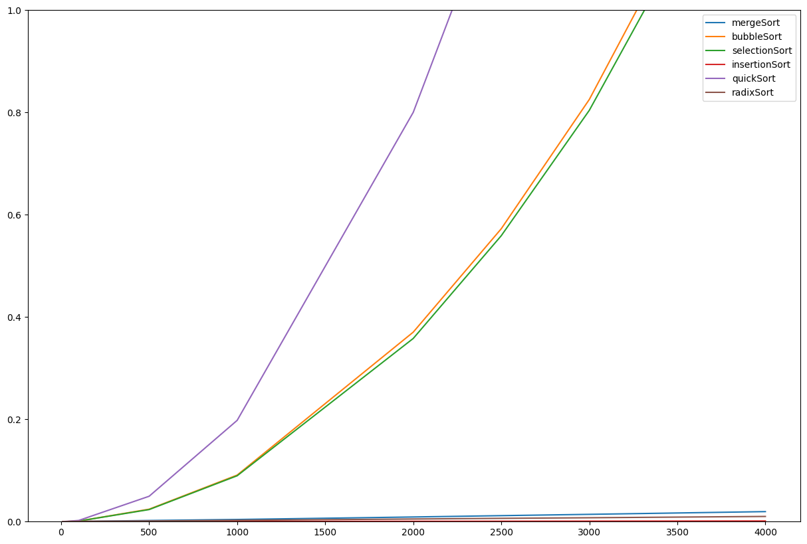

```python
from time import time   
import pandas as pd
import numpy as np
import seaborn as sns
from matplotlib import pyplot as plt

from sortFunc import mergeSort,bubbleSort,selectionSort,insertionSort,quickSort,radixSort

import sys
sys.setrecursionlimit(5000)
```


```python
#wrapper to count function execution time
from functools import wraps
import time

def timeit(func):
    @wraps(func)
    def timeit_wrapper(*args):
        start_time = time.perf_counter()
        result = func(*args)
        end_time = time.perf_counter()
        total_time = end_time - start_time
        return total_time
    return timeit_wrapper
```


```python
#initialize the sorting functions, data array and the array sizes
sortFuncs = [mergeSort, bubbleSort, selectionSort, insertionSort, quickSort]
funcExecTimeData = {"mergeSort":[], "bubbleSort":[], "selectionSort":[], "insertionSort":[], "quickSort":[], "radixSort":[]}
array_sizes = [10, 100, 500, 1000, 2000, 2500,3000,4000]
```


```python
#loop, execute and store time result
for size in array_sizes:
    random_array = np.random.randint(1,999,(1,size))[0]
    funcExecTimeData["mergeSort"].append(timeit(mergeSort)(random_array,0,size-1))
    funcExecTimeData["bubbleSort"].append(timeit(bubbleSort)(random_array))
    funcExecTimeData["selectionSort"].append(timeit(selectionSort)(random_array))
    funcExecTimeData["insertionSort"].append(timeit(insertionSort)(random_array))
    funcExecTimeData["quickSort"].append(timeit(quickSort)(random_array,0, size-1))
    funcExecTimeData["radixSort"].append(timeit(radixSort)(random_array))

```


```python
funcExtimedf = pd.DataFrame(funcExecTimeData, index=array_sizes)
funcExtimedf
```

<table border="1" class="dataframe">
  <thead>
    <tr style="text-align: right;">
      <th></th>
      <th>mergeSort</th>
      <th>bubbleSort</th>
      <th>selectionSort</th>
      <th>insertionSort</th>
      <th>quickSort</th>
      <th>radixSort</th>
    </tr>
  </thead>
  <tbody>
    <tr>
      <th>10</th>
      <td>0.000033</td>
      <td>0.000013</td>
      <td>0.000016</td>
      <td>0.000004</td>
      <td>0.000036</td>
      <td>0.000046</td>
    </tr>
    <tr>
      <th>100</th>
      <td>0.000349</td>
      <td>0.001062</td>
      <td>0.001018</td>
      <td>0.000033</td>
      <td>0.002253</td>
      <td>0.000653</td>
    </tr>
    <tr>
      <th>500</th>
      <td>0.002193</td>
      <td>0.024256</td>
      <td>0.023521</td>
      <td>0.000151</td>
      <td>0.049557</td>
      <td>0.001255</td>
    </tr>
    <tr>
      <th>1000</th>
      <td>0.004158</td>
      <td>0.090960</td>
      <td>0.089633</td>
      <td>0.000306</td>
      <td>0.197953</td>
      <td>0.002512</td>
    </tr>
    <tr>
      <th>2000</th>
      <td>0.009034</td>
      <td>0.370422</td>
      <td>0.358095</td>
      <td>0.000627</td>
      <td>0.800171</td>
      <td>0.005073</td>
    </tr>
    <tr>
      <th>2500</th>
      <td>0.011644</td>
      <td>0.572640</td>
      <td>0.559005</td>
      <td>0.000780</td>
      <td>1.252967</td>
      <td>0.006367</td>
    </tr>
    <tr>
      <th>3000</th>
      <td>0.014188</td>
      <td>0.825370</td>
      <td>0.804125</td>
      <td>0.000937</td>
      <td>1.805299</td>
      <td>0.007527</td>
    </tr>
    <tr>
      <th>4000</th>
      <td>0.019523</td>
      <td>1.473479</td>
      <td>1.429348</td>
      <td>0.001253</td>
      <td>3.237911</td>
      <td>0.010086</td>
    </tr>
  </tbody>
</table>
</div>
<div>
    <h3>Algorithms: Time Complexity</h3>
    <b>Merge Sort: 	O(n log(n)) </b>
    <b>Bubble Sort: 	O(n^2)	 </b>
    <b>Selection Sort: 	O(n^2)	</b>
    <b>Insertion Sort: 	O(n^2)	 </b>
    <b>Quick Sort: 	O(n^2) </b>
    <b>Radix Sort: 	O(nk) </b>


</div>


```python
plt.figure(figsize=(15,10))
frame = sns.lineplot(data=funcExtimedf, dashes=False,)
frame.set_ylim(0,1)
```

    

    

